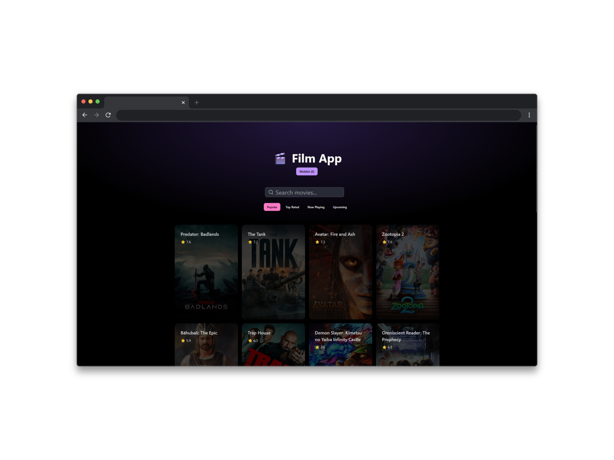

# 🎬 Film App

A React movie application that allows users to browse popular movies, search for films, view details, and manage a personal wishlist.



## Features

- 🎥 Browse movies by category (Popular, Top Rated, Now Playing, Upcoming)
- 🔍 Search for any movie
- 📄 View detailed movie information with cast
- 🎭 See similar movie recommendations
- ❤️ Add/remove movies to wishlist
- 💾 Wishlist saved in localStorage (persists after refresh)
- 📱 Responsive design with DaisyUI

## Technologies

- React
- React Router
- Tailwind CSS
- DaisyUI
- TMDB API

## Installation

### 1. Clone the repository

```bash
git clone https://github.com/taco-greco/React-Movie.git
cd movie-app
```

### 2. Install dependencies

```bash
npm install
```

### 3. Create environment file

Create a `.env` file in the root folder (same level as `package.json`):

```
VITE_TMDB_API_KEY=your_api_key_here
```

### 4. Get your TMDB API Key

1. Go to [themoviedb.org](https://www.themoviedb.org/)
2. Create a free account
3. Go to **Settings** → **API**
4. Copy your **API Key (v3 auth)** (not the Access Token!)
5. Paste it in your `.env` file

### 5. Run the app

```bash
npm run dev
```

The app will open at `http://localhost:5173`

## Project Structure

```
src/
├── components/
│   ├── MovieDetail.jsx     # Movie details page with actors & similar movies
│   ├── MovieList.jsx       # Grid of movie cards
│   ├── Search.jsx          # Search input component
│   ├── Wishlist.jsx        # Wishlist page
│   └── WishlistContext.jsx # Global state for wishlist
├── App.jsx                 # Main app with routes
├── main.jsx                # Entry point
└── App.css                 # Custom styles
```

## Author

Made with ❤️ by TacoGreco using React + TMDB API